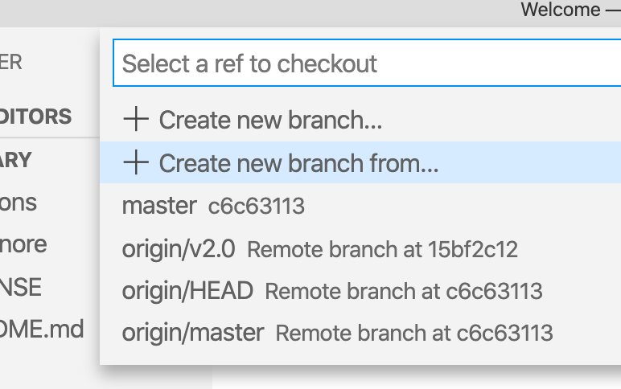
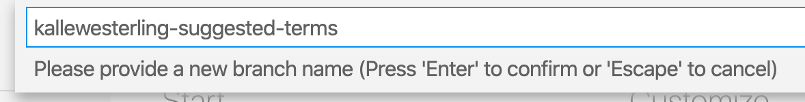
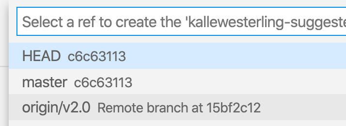
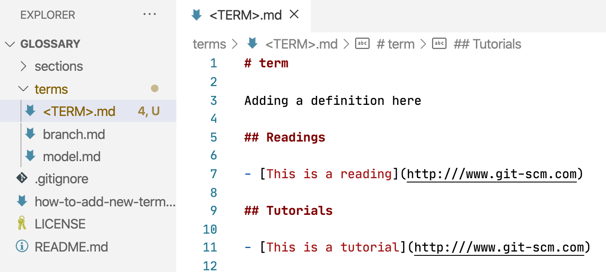
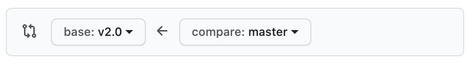
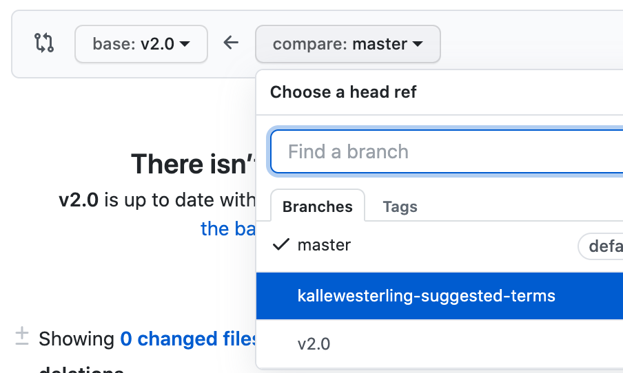
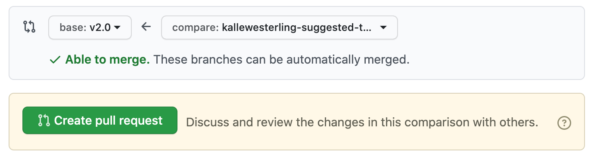
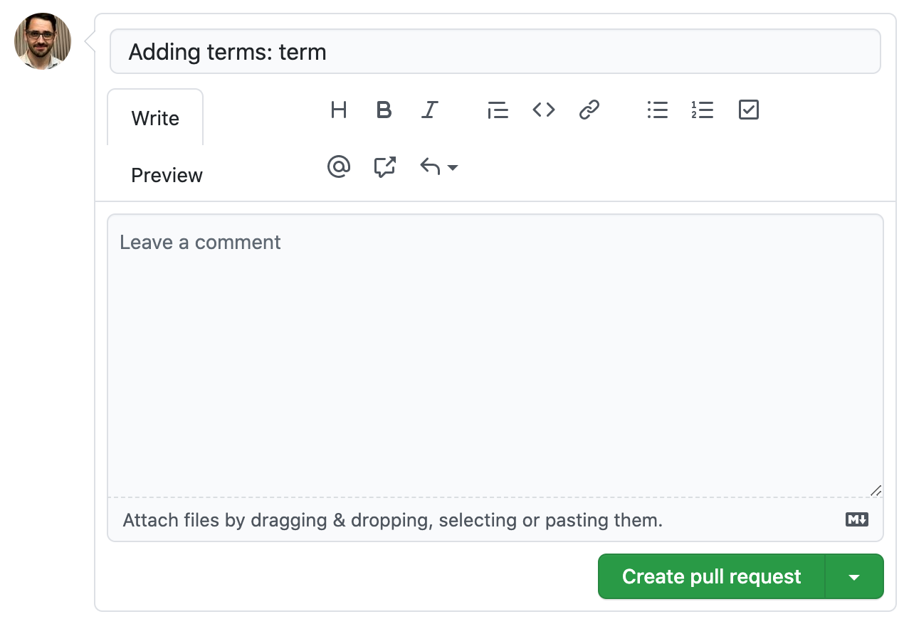

# How to add terms to this repository

In this tutorial, we will use VS Code but if you prefer, you can use any other editor or even command line tools.

## 1. Clone the repository.

1. Bring up the Command Palette (<kbd>command</kbd> <kbd>shift</kbd> <kbd>P</kbd>)
   
2. Type `git clone`
   
3. When asked to provide repository URL, paste `https://github.com/DHRI-Curriculum/glossary/` into the box.
   
4. VS Code will ask you where to save your local clone of the repository. Choose wherever you would like to have it.
   
5. When asked "Would you like to open the cloned repository?", press "Open in New Window" (to ensure no conflict with any other windows you may have open).

## 2. Create your own branch.
   
1. Click the branch name that you are currently on (likely "master") in the lower-left corner  
   

2. Select "Create new branch from..."  
   
   
3. Provide a branch name for your new branch (something like `<your-username>-suggested-terms`) followed by <kbd>enter</kbd>  
   
   
4. When asked to "Select a ref to create" your branch, select `origin/v2.0`  
   
   
5. You should now be on your own branch of this repository. You can verify that you're on the correct branch by checking your lower-left corner that should have your branch name instead of the formerly active branch.  
   

## 3. Add whichever term(s) you think should be added to the `terms` folder:

1. Each term should be in a separate `<term>.md` file. Keep the filename lowercase.
   
2. Add the term as the first header in the file (`# <term>`)
   
3. In the first paragraph after the first header, add the explanation of the term.
   
4. (Optional) Add a section `## Readings` where you add a bulletpoint for each _reading_ you think is valuable to grasp the term that you want to add to the glossary.
   
5. (Optional) Add a section `## Tutorials` where you add a bulletpoint for each _tutorial_ you think is valuable to grasp the term that you want to add to the glossary.

6. (Optional) Add a section `## Cheat sheets` where you add a bulletpoint for each _cheat sheet_ you think is good for the learner to know about to be able to understand the term.
   
(If you want a model file to look at, [here is one available](https://github.com/DHRI-Curriculum/glossary/blob/v2.0/terms/model.md).)
   
---

Once you are done with _all of the terms you would like to add_, your VS Code should look something like this:

---

## 4. Commit your changes and synchronize with GitHub.

1. Press the version control button in your menubar on the left (alternatively, you can choose `SCM` from the `View` menu).  
   

2. Hover over your term file(s) and press the `+` button to add the files to your commits. Once you press the `+` button, the file should move from the `Changes` section to the `Staged Changes` section. Once all your files with your terms are in the `Staged Changes` section, you are ready to move on.  
     
   
      
3. In the `Message` box, type an instructive message, something along the lines of `Adding terms: <Term 1>, <Term 2>, <Term 3>` and then press the checkmark above the message box (<kbd>✓</kbd>). Alternatively, you can press <kbd>command</kbd> <kbd>enter</kbd>.
   
4. Next, you want to synchronize your commit(s) with GitHub, by pressing the icon next to your branch name. If it's your first time, it will be a little cloud with an arrow into it. Otherwise, it will be two arrows forming a circle:   
     
   
   
## 5. Add a pull request to the `v2.0` branch

1. Navigate to GitHub's [Compare changes](https://github.com/DHRI-Curriculum/glossary/compare/v2.0...master) page.
   
2. Ensure that the `base` branch (the one you want to merge your changes _into_) is selected as `v2.0`:   
   

3. On the `compare` side, you want to choose your own branch in the popup menu:   
   

4. You should see a large, green button that says "Create pull request" and a green checkmark that says that you're able to merge:   
   
      
5. Press the "Create pull request" button, and fill out the form that pops up with some important information. _Note: If you filled out the commit above with information about all the terms you added, that should already be the title of your request and this should be an easy step._ Once you're done, press the green "Create pull request" button at the bottom of the form.  
     

You're done. Once someone gets around to it, your changes might be merged into the repository.
